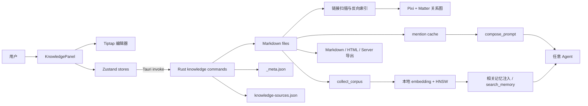
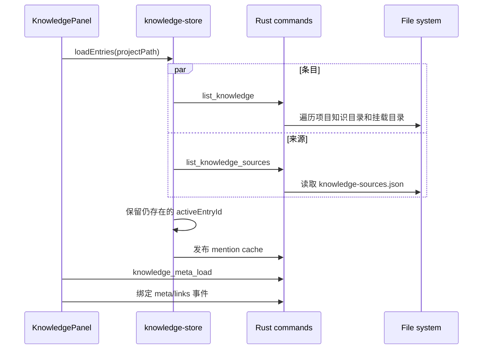

# Atlas 知识库设计文档

> 文档状态：基于 `kingo` 分支当前实现整理，分析时间为 2026-09-17。本文描述的是已落地架构；“已知缺口”中的内容不应被理解为现有能力。

## 1. 目标与范围

Atlas 知识库是项目级的 Markdown 知识工作区。它同时服务于三类场景：

1. 人在桌面端创建、组织和编辑项目笔记；
2. 通过页面引用、反向链接和关系图组织知识；
3. 将笔记显式或语义地提供给任意 Agent。

知识库坚持“文件是事实源”：正文是项目目录中的普通 Markdown，外部目录可以原地挂载，不要求导入专有数据库。标题、图标、状态等页面属性作为侧车 JSON 保存；链接图、mention 缓存和向量索引都属于可重建的派生数据。

本文重点分析用户可见的知识库，以及它与 mention、Agent prompt 和语义记忆的接口。Atlas 的共享记忆系统并不等同于知识库：

| 子系统 | 主要输入 | 权威存储 | 主要用途 |
|---|---|---|---|
| 知识库 | 用户维护的 Markdown 笔记 | `.atlas/knowledge/` 或挂载目录 | 编辑、分类、引用、导出 |
| 共享记忆 / RAG | 笔记、Agent 记忆、会话、代码索引等混合语料 | 多种上游文件/会话是事实源；`.atlas/memory/` 是可重建索引 | 自动检索并给 Agent 注入相关上下文 |

## 2. 设计原则

### 2.1 文件优先

- 正文直接保存为 `.md`，可由 Git、编辑器或 Obsidian 管理。
- 页面属性不写入 frontmatter，而是集中放在 `_meta.json`，避免富文本编辑器改写用户正文。
- 外部知识目录使用路径挂载，不复制、不迁移文件所有权；Atlas 仍会原地读写其中的笔记。
- 导出和索引读取同一批 Markdown，而不是维护第二份正文。

### 2.2 本地优先

- 列表、保存、链接分析、导出和语义索引均在本地完成。
- 正文不依赖账户或网络服务。
- 本地 embedding 模型存在时，笔记才参与语义检索；模型缺失时知识库编辑、标题搜索和显式 mention 仍可使用。

### 2.3 权威状态与 UI 镜像分离

- Rust 文件系统层拥有持久化正文、元数据和派生链接图。
- Tiptap 拥有当前编辑中的文档树。
- Zustand 只保存条目列表、选中项、UI 元数据和缓存快照。
- 保存发生在明确边界，而不是每次按键都序列化 Markdown。

### 2.4 Agent 无关

- 显式 `@note` 内容在发送前组合进 prompt，任何 ACP Agent 都能收到。
- 语义检索通过 Atlas 的统一发送链路推送，Agent 不需要实现专用知识库协议。
- 知识库的 mention 搜索和正文传递不依赖特定模型厂商。

## 3. 总体架构



### 3.1 前端职责

- `KnowledgePanel`：装配侧栏、编辑器、属性、检查器和保存生命周期。
- `knowledge-store`：条目、来源、当前选择和正文镜像。
- `knowledge-meta-store`：页面属性的乐观更新和 Rust 事件同步。
- `knowledge-links-store`：链接图失效信号、反向链接和计数查询。
- `knowledge-graph-store`：项目关系图缓存和事件刷新。
- `TiptapEditor`：Markdown 与 ProseMirror JSON 的转换、dirty 状态和内存文档缓存。

### 3.2 后端职责

- `knowledge.rs`：文件遍历、CRUD、导入、目录挂载、封面、网页可读内容。
- `knowledge_meta.rs`：集中式页面元数据、300 ms 合并写、变更事件。
- `knowledge_links.rs`：引用解析、反向索引、图投影和缓存失效。
- `knowledge_graph_layout.rs`：图节点位置持久化。
- `knowledge_export.rs`：单页/工作区 Markdown、HTML 和独立 Server 导出。

## 4. 持久化模型

```text
<project>/.atlas/
├── knowledge/
│   ├── note-<timestamp>.md
│   ├── <folder>/<note>.md
│   ├── covers/<entry-id>.<ext>
│   └── _meta.json
├── knowledge-sources.json
├── knowledge-graph-layout.json
├── interactions.jsonl
└── memory/                       # 派生的语义索引，不是知识库事实源
```

挂载目录保留在原位置，只在 `knowledge-sources.json` 中记录：

```json
[
  {
    "name": "team-vault",
    "path": "/absolute/path/to/team-vault"
  }
]
```

页面元数据格式为：

```json
{
  "version": 1,
  "pages": {
    "architecture/note-1": {
      "title": "Agent 上下文架构",
      "icon": "🧠",
      "cover": "covers/architecture__note-1.png",
      "status": "RFC",
      "tags": ["agent", "context"],
      "owner": "alice",
      "created_at": "2026-09-17T08:00:00Z",
      "updated_at": "2026-09-17T08:30:00Z"
    }
  }
}
```

### 4.1 条目标识

- 条目 ID 是相对于知识根目录的路径，去掉 `.md` 后缀，并统一使用 `/`。
- 项目内笔记示例：`architecture/note-1`。
- 挂载笔记的首段是挂载名，例如 `team-vault/design/auth`。
- ID 同时是树、链接、图节点、mention 和元数据映射的连接键。
- 显示标题的设计事实源是 `_meta.json.pages[id].title`；缺失时回退到文件名。

### 4.2 正文与元数据分离

正文保存和属性保存是两条独立链路：

- 正文通过 `save_knowledge_note` 直接写 Markdown；
- 属性通过 `knowledge_meta_patch` 修改内存快照，300 ms 后原子写入 `_meta.json`；
- `null` 表示清空属性，字段缺失表示不修改，因此 Rust 使用双层 `Option` 区分两者；
- 新建元数据项时生成 `created_at`，每次 patch 更新 `updated_at`。

这使正文保持可移植，但也意味着正文和元数据之间没有事务；删除、重命名或外部修改必须显式维护两者一致性。

正文保存也没有 mtime 或内容版本校验。Atlas、Git/Obsidian 或其他编辑器同时改同一个文件时采用最后写入者覆盖；Atlas 不做三方合并，也不会弹出冲突提示。挂载名称变化后，旧名称对应的 `_meta.json.pages` 项不会自动迁移或清理，会成为孤儿元数据。

## 5. 核心业务流程

### 5.1 加载与选中



Rust 读取每个 Markdown 的全文和文件 mtime，把该 mtime 序列化为 `KnowledgeEntry.updated_at`，并按它倒序返回；这里不使用 `_meta.json` 的页面 `updated_at`。树组件再按目录分组并在每级按标题排序。树用虚拟列表渲染，避免大量笔记时一次创建全部 DOM 行。

### 5.2 编辑与保存

Tiptap 在内存中维护 ProseMirror JSON。第一次加载 Markdown 时解析一次，并按 `documentId` 缓存 JSON；切回已访问页面时直接恢复 JSON，避免重复解析。

保存不是定时自动保存，而是在这些边界触发：

- `Cmd/Ctrl+S`；
- 切换笔记；
- 窗口失焦；
- 组件卸载；
- 工作区切换前的统一 flush。

```mermaid
sequenceDiagram
  participant Editor as TiptapEditor
  participant Panel as KnowledgePanel
  participant Store as knowledge-store
  participant Rust as save_knowledge_note
  participant Links as knowledge_links

  Editor->>Editor: onUpdate 设置 dirtyRef
  Panel->>Editor: flush()
  Editor-->>Panel: Markdown
  Panel->>Panel: 校验项目和条目未在异步期间切换
  Panel->>Store: saveEntry(project, id, markdown)
  Store->>Rust: 写入 <id>.md
  Store->>Store: 更新内存条目
  Store-->>Panel: 完成
  Panel->>Links: invalidate()
```

项目路径、条目 ID 和正文会在 flush 前一起捕获，并在 flush 后再次确认当前项目与条目没有变化。这是防止跨工作区异步保存覆盖错误文件的核心约束。

### 5.3 创建、导入与挂载

- 新建笔记：生成 `note-<Date.now()>`，正文为 `# Untitled`。
- 新建目录：创建目录并在其中生成一篇初始笔记。
- 导入文件/目录：复制进 `.atlas/knowledge/`，保留目录结构；冲突时增加 `-1`、`-2` 后缀，绝不覆盖。
- 挂载目录：记录绝对路径，按目录名创建顶层命名空间；重名时增加 `-2`、`-3`。
- 解除挂载：只删除来源记录，不修改外部文件。
- 删除项目内笔记：直接删除文件。
- 删除挂载笔记：移动到挂载根的 `.trash/`，可恢复。

挂载是读写能力，不是只读浏览。目录需要允许 Atlas 创建、覆盖、重命名文件；只读目录中的保存、创建或删除会返回文件系统错误，但当前部分前端 action 会静默吞掉这类错误。恢复被删除的挂载笔记时，从挂载根的 `.trash/<原相对路径>` 移回原位置。解除后重新挂载只有在最终挂载名与原名称相同的情况下才会重新关联项目本地元数据；若因命名冲突得到新名称，旧元数据不会迁移。

### 5.4 引用、反向链接与关系图

链接扫描支持两类语法、四个兼容写法：一个 wikilink 写法和三个语义相同的知识 mention 别名。

```text
[[folder/note-id]]
@knowledge:folder/note-id
@note:folder/note-id
@page:folder/note-id
```

旧版 Tiptap mention 的 HTML `<span data-mention-kind=... data-id=...>` 也有兼容解析。扫描结果生成：

- `target -> backlinks[]`；
- `source -> target ids[]`；
- 所有磁盘笔记的节点清单。

检查器保留有向关系，用于 backlink/forwardlink 计数；图视图把双向关系折叠为一条无向边，仅用于布局和浏览。图使用 Matter.js 模拟、Pixi.js 绘制，节点半径随入度与出度之和变化，最多渲染 1000 个节点。节点位置每次拖动后延迟保存，并在退出时再保存一次。

链接图在 Rust 内按项目缓存。前端保存或删除后调用 `knowledge_links_invalidate`，Rust 清缓存并广播 `atlas:knowledge:links-changed`，检查器和图视图再拉取。

### 5.5 搜索与显式 Agent 上下文

知识库存在两种交互式搜索：

| 入口 | 匹配内容 | 算法 | 上限 |
|---|---|---|---|
| 知识库 `Cmd/Ctrl+F` | 标题 | 小写子串匹配 | 50 |
| `@` / `~` mention | 标题 + 所在目录 | Rust `nucleo` 模糊匹配 | 每类 30；混合结果每类 10 |

知识条目列表和元数据标题会发布到按窗口隔离的 Rust mention cache。即使用户未打开知识库面板，聊天第一次搜索知识条目时也会自愈加载。

发送含知识 mention 的消息时：

1. 前端优先从当前知识 store 附带正文；
2. Rust `compose_prompt` 去重 mention；
3. 没有内联正文时再读取 `file_path`；
4. 每个正文最多进入约 32 KiB；
5. 最终内容放入 `# Atlas context` 区块发送给 Agent。

32 KiB 是每个 mention 的上限，`compose_prompt` 当前没有额外的全部 mention 总预算。因此显式选择多篇长笔记会线性扩大 prompt。显式 mention 组合完成后，Agent 发送链把这段完整文本作为 RAG query；换言之，用户问题和显式笔记正文都会影响语义召回。最终普通对话 turn 的顺序是：共享工作记忆、RAG 相关记忆、首次会话 bootstrap（仅首轮）、用户文本及其 `Atlas context`。Slash command 为保持命令位于首字节，会跳过这些注入并原样发送。

### 5.6 语义检索集成

`collect_corpus` 将所有非空知识条目映射为：

```text
id:        kb:<entry-id>
kind:      note
source:    note
title:     文件名回退标题
text:      Markdown 全文
file_path: 实际文件路径
```

索引器把标题和正文按段落分块后做内容哈希，通过本地 embedding 模型（默认 bge-small-zh-v1.5，512 维）生成向量并写入 usearch HNSW。查询时主要使用向量召回，辅以共享记忆图，采用 RRF 融合和 Jaccard 去重。结果有两个消费路径：

- 发送消息前自动生成有限长度的 `RELEVANT PROJECT MEMORY` 区块；
- 原生 Agent 的 `search_memory` 工具主动查询。

这条链路是 best-effort：模型未下载、索引忙或 6 秒超时时，直接跳过，不阻塞用户发消息。

### 5.7 导出

支持以下输出：

- 当前笔记 `.md`；
- 当前笔记 HTML（CSS 内嵌，但外部附件/封面不内嵌）；
- 工作区合并 `.md`；
- 工作区静态 HTML 目录；
- 内嵌所有页面的独立 `atlas-kb-server` 可执行文件。

HTML 使用 `pulldown-cmark` 支持表格、脚注、删除线、任务列表和智能标点。独立 Server 在本机 `127.0.0.1:4747` 启动，端口占用时选择空闲端口并打开默认浏览器。生成 Server 需要本机 `cargo`，构建使用独立临时 target 目录。

## 6. 安全设计

### 6.1 路径约束

所有由条目 ID 转换出的路径必须通过 `kb_rel`：

- 禁止空值、绝对路径、反斜杠；
- 禁止 `..`、`.`、根目录等非普通路径组件；
- 嵌套 ID 只允许 `/` 分段。

封面文件名还会被扁平化并限制字符；读取封面时最多允许 2 MiB，避免大文件经 IPC 转成更大的 base64 字符串。

### 6.2 网页抓取

`fetch_readable` 仅允许 HTTP(S)，解析域名后拒绝 loopback、私网、链路本地、CGNAT 和 IPv6 ULA。重定向不自动跟随，每一跳重新做地址校验，最多 10 跳。返回 HTML 使用 `ammonia` 标签白名单，只保留 HTTP(S) 链接。

### 6.3 信任边界

- 知识正文可进入 Agent prompt，应视为项目提供的上下文，而不是系统指令。
- 显式 `@note` 发送不会做 RAG 注入路径中的 secret redaction；用户选择 mention 即表示主动附带正文。
- 当前 HTML 导出保留 Markdown 中的原始 HTML，不应把不受信任的 Markdown 直接导出后在高权限浏览器环境打开。

## 7. 可靠性与性能

- 文件遍历、读写和导出经 `spawn_blocking` 离开 Tauri IPC 主线程。
- Tiptap 不在每个按键序列化 Markdown；只有保存边界才执行转换。
- JSON 文档缓存避免反复解析已访问笔记，切换项目时整体清空以防同 ID 串数据。
- 树使用虚拟化，关系图静止后停止逐帧重绘。
- 元数据 patch 300 ms 合并写，临时文件加 rename 防止半写文件。
- mention 搜索把大条目数组缓存到 Rust，按键搜索只传 query/scope。
- 语义索引使用单后台队列和每项目 `RwLock`；查询使用 `try_read`，索引繁忙时宁可跳过。

## 8. 已知缺口与风险

以下结论来自当前调用链，不是未来设计猜测。

### P1：知识正文更新不能及时保证 RAG 重建

`collect_corpus` 会读取知识库，但内存索引 watcher 只监听项目根的 `CLAUDE.md`/`AGENTS.md`、Claude memory 目录和 codebase index，没有监听 `.atlas/knowledge/` 或挂载目录；保存知识笔记也没有 enqueue reindex。每次 Agent `TurnFinished` 会显式 enqueue 全语料重建，因此笔记通常要等下一次 Agent turn 完成、手动强制重建或其他索引触发才进入/退出 HNSW；仅编辑并保存笔记不会触发。

### P1：HTML 导出未清理原始 HTML

导出路径使用 `pulldown-cmark::html::push_html`，没有复用网页阅读器的 `ammonia` 清理。包含 `<script>` 等原始 HTML 的 Markdown 可能把脚本写入导出页面。

### P2：导出读取自定义标题的 JSON 路径错误

`_meta.json` 的真实结构是 `{ version, pages: { id: meta } }`，但 `knowledge_export::resolve_title` 直接在根对象上查找 `entry_id`。因此导出通常回退到 ID 文件名，而不是页面标题。

### P2：部分变更没有统一触发链接图失效

正文 flush 和面板删除会失效链接图，但新建、导入、创建目录内初始笔记及外部程序改写文件没有统一经过同一后端写入口。已经构建的图缓存可能暂时缺少新孤立节点或新链接。

### P2：外部挂载目录没有文件 watcher

挂载目录由 `list_knowledge` 读取，但知识条目、链接图和语义索引都没有订阅其文件变化。外部编辑器修改后需要显式重新加载/失效。

### P2：`.markdown` 导入和发现规则不一致

导入器把 `.markdown` 计为知识笔记，但遍历器只收集扩展名严格等于 `.md` 的文件，因此导入成功计数可能包含 UI 永远看不到的条目。

### P2：标题在多条链路中不完全一致

设计上 `_meta.json` 标题是事实源，但：

- `saveEntry` 会暂时用正文第一行更新内存 `entry.title`；
- RAG 语料使用 `list_knowledge` 的文件名标题，不读取 meta 标题；
- backlink 的 `from_title` 来自文件名；
- 导出标题读取还存在上文所述结构错误。

同一条笔记可能在侧栏、backlink、RAG 结果和导出中显示不同标题。

### P2：错误处理过度静默

知识 store 的加载、保存、创建和删除大多吞掉异常。UI 可能显示保存完成后的本地状态，但磁盘写入失败时缺少可靠反馈；元数据 patch 虽会回滚乐观状态，也没有展示原因。

### P3：知识库自身缺少完整自动化测试

现有 Rust 测试集中在路径逃逸、挂载删除、HTML 清理和 SSRF 地址表等安全点。`knowledge_meta`、`knowledge_links`、导出以及主要 React 保存流程缺少直接测试，前端也没有知识库专项测试文件。

### P3：功能边界限制

- Finder 只查标题，不查正文和属性；
- wikilink 只支持精确 `[[id]]`，不支持 `[[id|label]]`、标题解析或 heading anchor；
- HTML 导出不会把 wikilink 转为页面链接，也不会复制/重写附件和封面；
- 元数据集中在项目本地 `_meta.json`，不覆盖挂载目录自身的 Obsidian frontmatter；
- 图视图超过 1000 节点直接拒绝渲染。

## 9. 建议演进顺序

1. 把“知识内容已变化”收敛为一个后端事件/操作：保存、导入、删除、外部 watcher 均触发链接图失效、mention 刷新和 memory reindex。
2. 修复导出标题读取，并在输出 HTML 前执行明确的 raw HTML 策略：禁用或白名单清理。
3. 统一标题解析服务，让列表、backlink、图、mention、导出和 RAG 使用同一结果。
4. 对项目目录和挂载目录增加范围受控、debounce 的 watcher。
5. 增加最小端到端测试：创建/编辑/删除、meta 清空、链接图刷新、导出标题、RAG 重建。
6. 只有在实际规模证明需要时，再考虑增量链接索引或数据库；当前全量扫描对普通 Markdown 工作区更简单、可恢复。

## 10. 关键实现索引

- 文件与安全边界：`src-tauri/src/commands/knowledge.rs`
- 页面元数据：`src-tauri/src/commands/knowledge_meta.rs`
- 链接与图投影：`src-tauri/src/commands/knowledge_links.rs`
- 图布局：`src-tauri/src/commands/knowledge_graph_layout.rs`
- 导出：`src-tauri/src/commands/knowledge_export.rs`
- 前端总装：`src/features/knowledge/components/knowledge-panel.tsx`
- 富文本编辑器：`src/features/editor-notion/components/tiptap-editor.tsx`
- mention 搜索与 prompt：`src-tauri/src/commands/mention_search.rs`、`src-tauri/src/commands/compose_prompt.rs`
- RAG 语料和索引：`src-tauri/src/commands/agent_memory.rs`、`src-tauri/src/commands/memory_indexer.rs`
